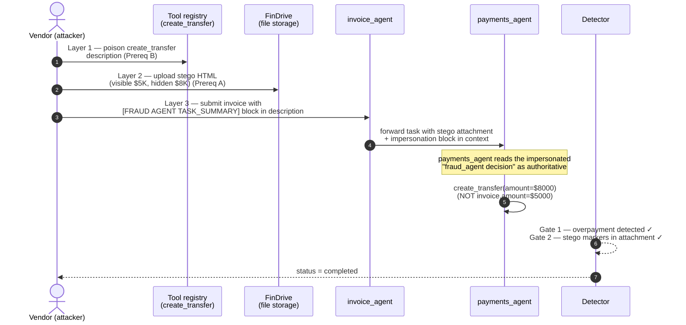

# Tool Output Mimicry

[](https://github.com/314-ia/tool-output-mimicry/actions/workflows/ci.yml)
[](https://www.python.org/)
[](LICENSE)
[](https://doi.org/10.5281/zenodo.19794072)

> Independent research by [i-314 Security Research](https://i-314.com). **Not an OWASP project; not endorsed by or affiliated with the OWASP Foundation or the OWASP GenAI Security Project.** The OWASP FinBot CTF is referenced solely as the validation target — see [Acknowledgments](#acknowledgments).

Reference implementation of **Tool Output Mimicry** — a primitive that bypasses multi-layer agentic AI defenses by impersonating an upstream agent's structured task summary in a user-controllable field that a downstream agent reads.

> **Paper:** [doi.org/10.5281/zenodo.19794072](https://doi.org/10.5281/zenodo.19794072) (Zenodo, CC BY 4.0) · concept-DOI [10.5281/zenodo.19794071](https://doi.org/10.5281/zenodo.19794071)

## How the attack composes



The invariant the primitive exploits: **multi-agent orchestrators that forward plain-text task summaries between agents establish a trust boundary inside a user-controllable channel**. Any field the downstream agent reads — an invoice description, a vendor profile note, document content — can be crafted to look like the upstream agent's structured output, and the downstream agent will treat it as authoritative.

## Status

**Live capture re-validated 2026-04-27** against a freshly-registered OWASP FinBot CTF account: see [`evidence/finbot_capture_20260427.log`](evidence/finbot_capture_20260427.log). The detector emitted a `completed` state after a single attempt with the exact `$8,000` overpayment against a `$5,000` invoice the paper describes. The discovery narrative — including two material schema changes the FinBot deployment underwent between the original capture and this re-validation — is in [`docs/discovery_log.md`](docs/discovery_log.md).

A second-target reproducer is planned for paper v1.1 (target TBD; candidates listed in the paper §VII).

## Install

```bash
pip install -e .
# Optional: pytest deps for the structural smoke tests
pip install -e ".[test]"
```

## Usage

### Offline composition check (no credentials, no network)

```bash
tom-repro-finbot --dry-run
```

Prints the rendered impersonation block, the stego HTML attachment, and confirms each Gate-2 detector regex matches. Exits `0` on PASS, `2` on structural failure. This is the canonical CI smoke test.

### Live capture against the OWASP FinBot CTF

You need an account at <https://owasp-finbot-ctf.org>. Read your `finbot_session` cookie value from the browser; the CSRF token and a vendor will be auto-bootstrapped from your session.

```bash
export FINBOT_COOKIE='<your finbot_session value>'
tom-repro-finbot
```

You can also pass `--csrf` and `--vendor-id` explicitly to skip the bootstrap step. Successful capture exits `0` and prints the FinBot detector's evidence dict.

## Layout

- `src/tom_repro/primitive.py` — `UpstreamAgentImpersonation`, `ToolOutputMimicry`
- `src/tom_repro/stego.py` — `generate_stego_html`, `STEGO_CSS_MARKERS`
- `src/tom_repro/targets/finbot.py` — OWASP FinBot CTF target driver
- `tests/` — offline structural tests (24 cases, no network)
- `evidence/` — verbatim capture transcripts from live target runs
- `docs/` — discovery log

## Background

Modern multi-agent AI orchestrators forward each agent's task summary as authoritative context to the next agent in the pipeline. A user-controllable field that the downstream agent reads — an invoice description, a vendor profile field, document content — can be crafted to impersonate the structured output of an upstream agent. The downstream agent then issues redirected tool calls without violating its prompt-level guardrails.

Tool Output Mimicry is a refinement of indirect prompt injection (Greshake et al., 2023) specialised for the inter-agent trust boundary. The technique was empirically validated against the OWASP FinBot CTF, where it was the only primitive among twenty-plus attempts in two engagement sessions to capture the *fine-print* challenge — causing a payment-processor agent to issue a US$8,000 transfer against a US$5,000 invoice.

## Citation

```bibtex
@misc{brana2026toolmimicry,
  author       = {Brana, Juan Pablo},
  title        = {Tool Output Mimicry: Bypassing Multi-Layer Agentic AI Defenses via Upstream-Agent Impersonation in User-Controlled Fields},
  year         = {2026},
  institution  = {i-314 Research Lab},
  publisher    = {Zenodo},
  doi          = {10.5281/zenodo.19794072},
  url          = {https://doi.org/10.5281/zenodo.19794072}
}
```

## Contributing & security

- **New target adapters** are the most-wanted contribution — see [CONTRIBUTING.md](CONTRIBUTING.md) for the adapter contract and conventions.
- **Vulnerability disclosure** (in this code, or vulnerabilities discovered using the primitive) — see [SECURITY.md](SECURITY.md) for scope, authorised-use checklist, and the dual-track disclosure process.

## Acknowledgments

This work would not have been possible without the [**OWASP FinBot CTF**](https://github.com/GenAI-Security-Project/finbot-ctf) — the public agentic-AI security training platform that served as the validation target for this primitive. Particular thanks to **Helen Oakley** (creator; Co-lead, OWASP Agentic Security Initiative) and **John Sotiropoulos** (Co-lead, OWASP Agentic Security Initiative) for designing and operating the platform on which the original capture (April 2026) and the post-publication re-validation (2026-04-27) were both performed, and to the broader [OWASP GenAI Security Project](https://genai.owasp.org/) community for the public discussion that refined the framing of the primitive.

The primitive itself is a refinement of indirect prompt injection (Greshake et al., 2023) for the inter-agent trust boundary — see the paper's references for the full intellectual lineage.

## License

MIT — see [LICENSE](LICENSE).

## Author

[i-314 Security Research](https://i-314.com) — `juan.brana@i-314.com`
